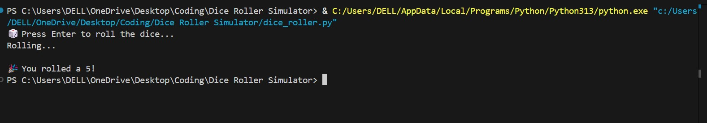

#  Dice Roller Simulator

A simple Python CLI tool that simulates rolling a six-sided die. When the user presses `Enter`, the program displays a short countdown animation and then reveals a random number between 1 and 6 — just like rolling a real dice!

---

##  Demo

  

---

##  How to Run

1. **Clone the Repository**
   ```bash
   git clone https://github.com/yourusername/dice-roller-simulator.git
   cd dice-roller-simulator
2.Run the Script
 ```bash
python dice_roller.py
```
How It Works

Waits for the user to press Enter

Shows a short countdown using time.sleep()

Generates a number between 1 and 6 using random.randint()

Displays the result as the dice roll outcome
